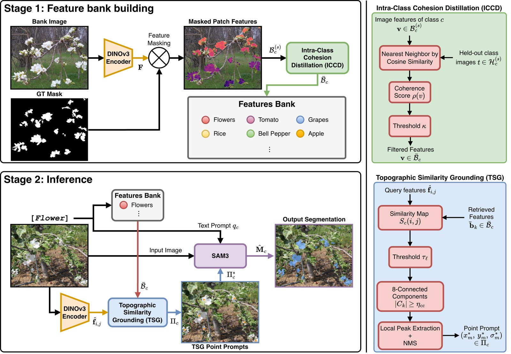
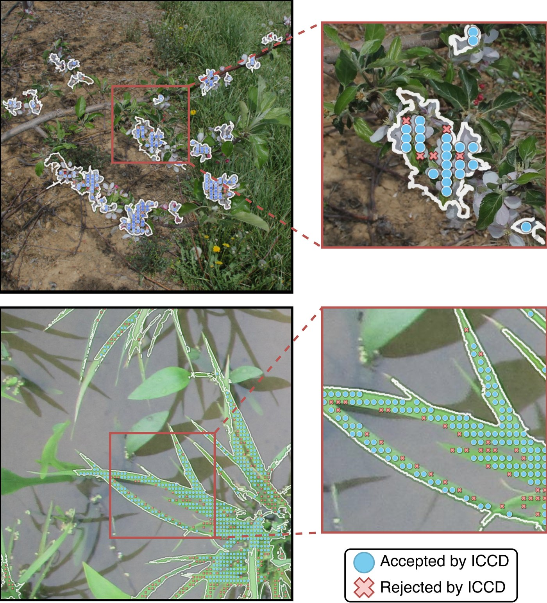
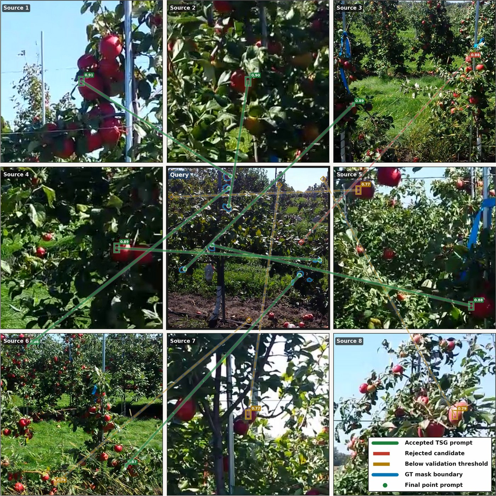
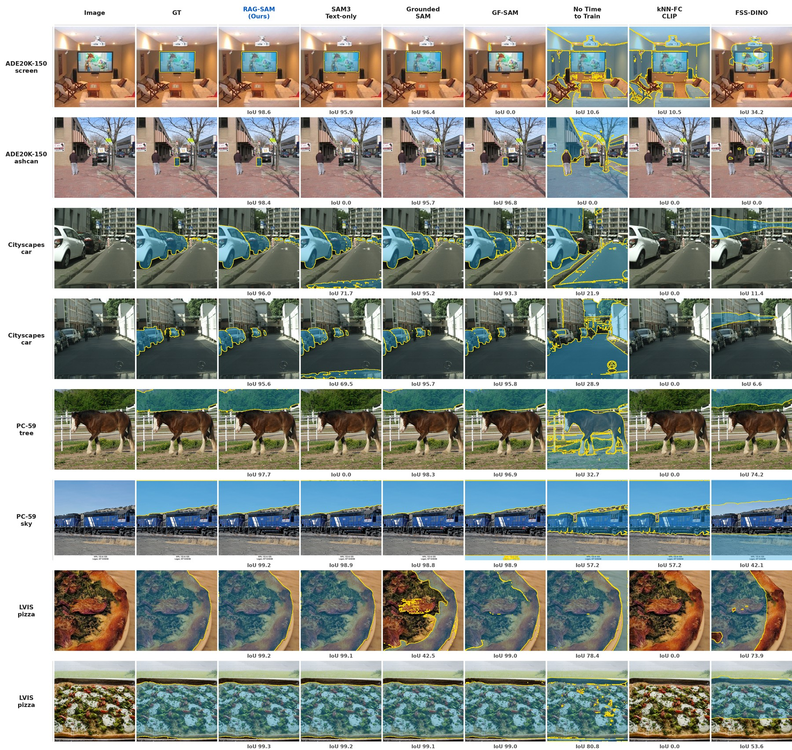
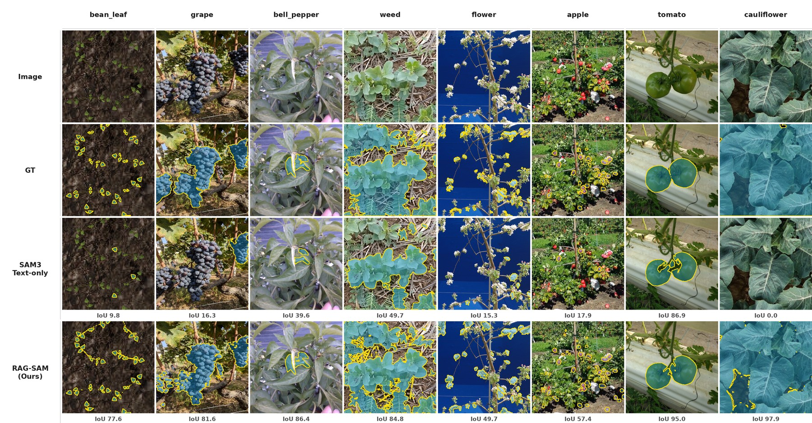

# SegRAG: Training-Free Retrieval-Augmented Semantic Segmentation

SegRAG is a training-free semantic segmentation framework that augments SAM 3
with spatial evidence retrieved from a class-indexed DINOv3 feature bank. It is
designed for cases where text-only grounding is ambiguous or fails under domain
shift: the class name tells SAM 3 *what* to segment, while retrieved DINOv3
matches provide point prompts telling it *where* the target class appears.

During an offline stage, SegRAG extracts dense DINOv3 ViT-L/16 descriptors from
annotated reference images and filters them with **Intra-Class Cohesion
Distillation (ICCD)**, retaining prototypes that consistently retrieve
same-class foreground. At inference time, **Topographic Similarity Grounding
(TSG)** converts the query-prototype similarity landscape into spatially
coherent point prompts. The class text and points are then delivered to SAM 3 in
a single joint prompting pass. SegRAG requires no model training, no synthetic
data, and no task-specific weight updates.



## Quick Start

### 1. Install

The expected layout keeps SegRAG next to local DINOv3 and SAM 3 checkouts:

```bash
mkdir -p ~/RAG-SAM
cd ~/RAG-SAM
git clone https://github.com/boudiafA/SegRAG.git SegRAG
git clone https://github.com/facebookresearch/dinov3.git dinov3
git clone https://github.com/facebookresearch/sam3.git sam3
```

Create the environment and install SegRAG:

```bash
cd ~/RAG-SAM/SegRAG
conda env create -f environment.yml
conda activate segrag
pip install -e .
```

Install SAM 3 following the official SAM 3 repository instructions. SegRAG
resolves DINOv3 from `../dinov3` by default. Override paths if your checkout or
weights are elsewhere:

```bash
export DINOV3_REPO_PATH=/path/to/dinov3
export DINOV3_WEIGHTS_PATH=/path/to/dinov3_vitl16_pretrain_lvd1689m.pth
```

### 2. Prepare A COCO/LVIS-Style Dataset

The main runner expects:

```text
dataset_root/
  train.json
  val.json
  images/
```

`train.json` provides annotated reference images for the feature bank.
`val.json` or `test.json` provides query images and masks for evaluation. Each
annotation file should contain COCO/LVIS-style `images`, `annotations`, and
`categories` arrays. Polygon and RLE masks are supported.

LVIS-style split folders are also detected:

```text
dataset_root/
  train/lvis_v1_train.json
  train/images/
  val/lvis_v1_val.json
  val/images/
```

### 3. Run SegRAG

Run the full text+point pipeline:

```bash
python scripts/run_pipeline.py \
  --dataset-root /path/to/dataset_root \
  --segmentation-method text-and-point \
  --reference-images-per-class 5 \
  --feature-matching-method hybrid \
  --resume \
  --save-mask-json
```

Change `--reference-images-per-class` to run another shot setting, for example
`1`, `5`, or `20`.

Run the SAM 3 text-only baseline on the same split:

```bash
python scripts/evaluate_sam3.py \
  --dataset-root /path/to/dataset_root \
  --prompt-mode text_prompt \
  --resume \
  --save-mask-json
```

Run ADE20K-150 through the built-in adapter:

```bash
python scripts/run_ade20k.py \
  --dataset-root /path/to/ade20k_root \
  --dataset-format ade20k_150 \
  --segmentation-method text-and-point \
  --reference-images-per-class 5 \
  --resume
```

Run an automatically detected adapter-supported dataset:

```bash
python scripts/run_adapters.py \
  --dataset-root /path/to/raw_dataset \
  --adapter auto \
  --segmentation-method text-and-point \
  --reference-images-per-class 5 \
  --resume
```

Generated artifacts are written under the dataset root:

```text
feature_bank_dinov3_vitl16_1536/
feature_bank_dinov3_vitl16_1536_scored_thr060/
feature_bank_adaptive_q75_from_thr060/
_prompt_cache/
evaluation_results_*/
```

Use a separate dataset/output root per shot setting if you need strict protocol
separation.

## Model Overview

SegRAG has two retrieval-specific modules.

**ICCD: filtering the feature bank.** Dense patch descriptors are extracted from
annotated reference images using frozen DINOv3. Instead of storing every
foreground patch, ICCD scores each candidate by how reliably it retrieves
same-class foreground in held-out reference images. This removes boundary
patches, ambiguous descriptors, and annotation-noise artifacts before inference.



**TSG: turning retrieval into prompts.** At inference, SegRAG compares query
features against the filtered class bank and obtains a dense similarity map.
TSG keeps spatially coherent high-confidence connected components, extracts
representative peaks with non-maximum suppression, and sends those locations to
SAM 3 as positive point prompts.



**Joint prompting.** SegRAG sends class text and TSG points to SAM 3 in one
joint grounding pass. Text provides semantic intent; points provide spatial
evidence. If no reliable retrieval prompt is found, the system can fall back to
text-only SAM 3.

## Results

### Standard Benchmarks

All values below are mIoU (%). SegRAG uses a DINOv3 ViT-L/16 feature bank and
SAM 3 joint text+point prompting. SAM 3 is the direct text-only baseline.

| Method | Setting | ADE20K-150 | Cityscapes | PC-59 | LVIS |
|---|---:|---:|---:|---:|---:|
| SAM 3 | text | 52.26 | 64.78 | 65.62 | 54.92 |
| Grounded SAM | text | 48.76 | 47.41 | 62.38 | 47.33 |
| GF-SAM | 1-shot | 43.66 | 35.17 | 53.29 | 35.20 |
| GF-SAM | 5-shot | 50.65 | 40.04 | 62.21 | 44.20 |
| CorrCLIP | text | 26.90 | 49.40 | 48.80 | - |
| **SegRAG** | **1-shot** | **53.52** | **66.35** | **65.91** | **56.71** |
| **SegRAG** | **5-shot** | **54.77** | **67.25** | **66.77** | **58.84** |

SegRAG 5-shot improves over SAM 3 text-only by `+2.51` on ADE20K-150, `+2.47`
on Cityscapes, `+1.15` on PC-59, and `+3.92` on LVIS.



### Agricultural Domain Generalisation

On AgML agricultural benchmarks, text-only SAM 3 fails completely on several
field-imaged crop and weed categories. SegRAG recovers these classes by using
real annotated references as visual evidence.

| Class | SAM 3 Text IoU | SegRAG IoU | Delta |
|---|---:|---:|---:|
| apple | 37.27 | 37.65 | +0.38 |
| bean leaf | 4.81 | 63.91 | +59.10 |
| bell pepper | 74.21 | 81.16 | +6.94 |
| carrot | 0.00 | 19.90 | +19.90 |
| cauliflower | 0.00 | 95.36 | +95.36 |
| flower | 31.36 | 40.68 | +9.33 |
| grape | 54.93 | 71.21 | +16.28 |
| rice | 0.00 | 39.93 | +39.93 |
| sugarbeet weed | 0.00 | 80.22 | +80.22 |
| tomato | 67.12 | 67.80 | +0.68 |
| weed | 8.26 | 53.78 | +45.52 |
| **Mean** | **25.27** | **59.24** | **+33.97** |



### Ablations

Component ablation on the full AgML evaluation set:

| Configuration | IoU | mIoU | F1 | Precision | Recall |
|---|---:|---:|---:|---:|---:|
| SAM 3 text-only | 0.317 | 0.253 | 0.481 | 0.849 | 0.336 |
| Raw bank + TSG | 0.274 | 0.444 | 0.430 | 0.312 | 0.691 |
| ICCD bank, no TSG | 0.271 | 0.388 | 0.426 | 0.314 | 0.661 |
| **SegRAG full** | **0.628** | **0.592** | **0.772** | **0.857** | **0.702** |

Shot-count ablation:

| References Per Class | IoU | mIoU | F1 | Recall |
|---:|---:|---:|---:|---:|
| 1 | 0.549 | 0.585 | 0.709 | 0.610 |
| 5 | 0.570 | 0.585 | 0.726 | 0.631 |
| 10 | 0.550 | 0.587 | 0.710 | 0.610 |
| 20 | 0.617 | 0.592 | 0.763 | 0.687 |
| 30 | 0.628 | 0.592 | 0.772 | 0.702 |

## Repository Layout

```text
SegRAG/
  src/segrag/
    data/        dataset export and shot-list utilities
    modeling/    DINOv3 matching, ICCD, SAM 3 prompt execution
    pipelines/   high-level end-to-end runners
    stages/      stage-level wrappers and evaluation code
    utils/       paths, metrics, cache, and resume helpers
  scripts/       stable CLI entrypoints
  configs/       dataset run templates
  examples/      short runnable examples
  tests/         regression and equivalence checks
```

After `pip install -e .`, the same tools are also exposed as console commands:

```bash
segrag-run
segrag-run-adapters
segrag-run-ade20k
segrag-evaluate-sam3
segrag-generate-support-shots
segrag-prepare-pascal5i
```

## Development Checks

```bash
PYTHONPATH=src python -m compileall -q src scripts tests
PYTHONPATH=src python scripts/run_pipeline.py --help
PYTHONPATH=src python scripts/evaluate_sam3.py --help
```

## Citation

The citation entry will be added after paper metadata is finalized.
