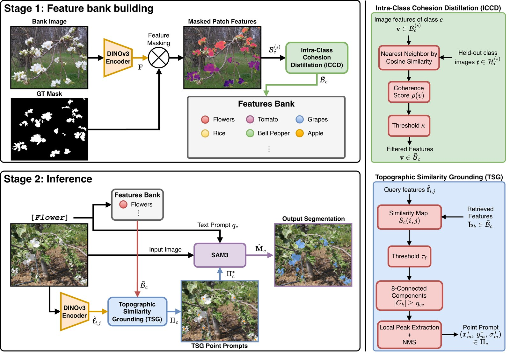
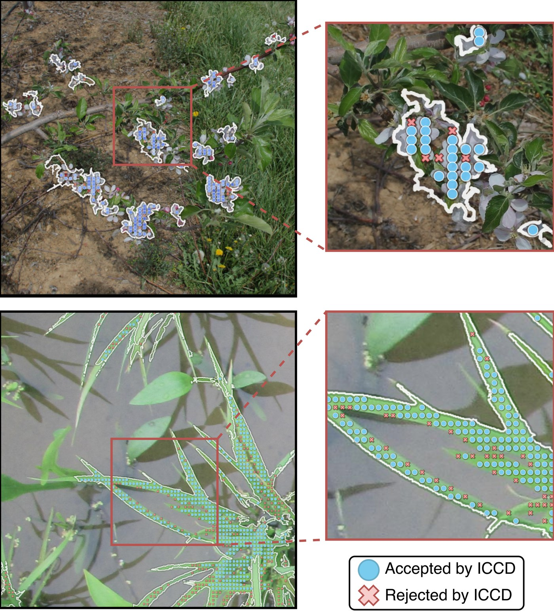
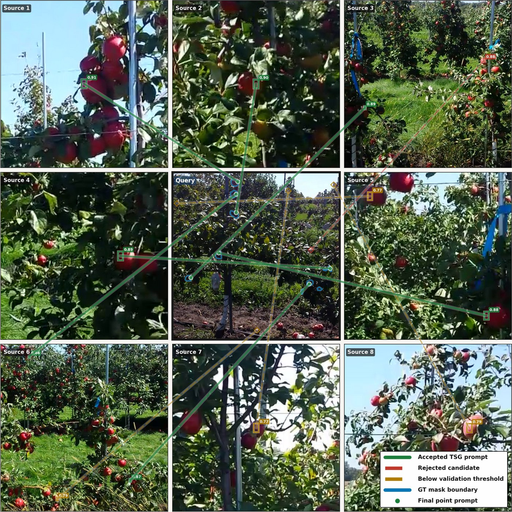
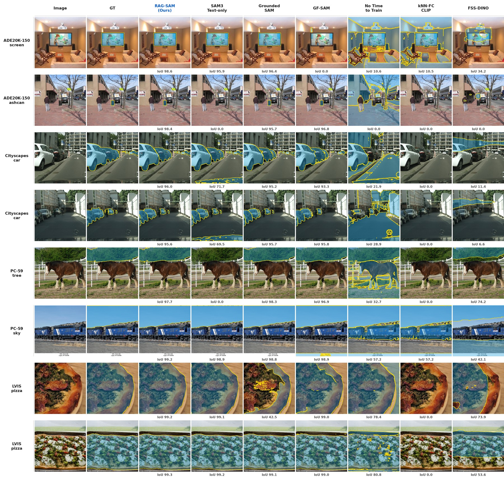
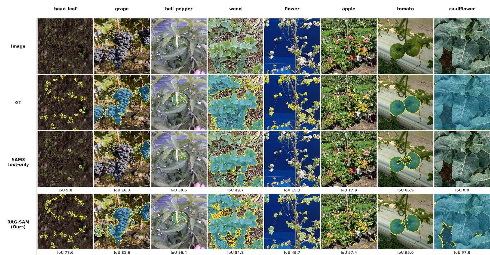

# SegRAG: Retrieval Augmented Spatial Prompting for Open Vocabulary Semantic Segmentation

Accepted at **Information Processing & Management**.

SegRAG is a training-free semantic segmentation framework that augments SAM 3
with spatial evidence retrieved from a class-indexed DINOv3 feature bank. It is
designed for cases where text-only grounding is ambiguous or fails under domain
shift: the class name tells SAM 3 *what* to segment, while retrieved DINOv3
matches provide point prompts telling it *where* the target class appears.

During an offline stage, SegRAG extracts dense DINOv3 ViT-L/16 descriptors from
annotated reference images and filters them with **Intra-Class Cohesion
Distillation (ICCD)**, retaining prototypes that consistently retrieve
same-class foreground. At inference time, **Topographic Similarity Grounding
(TSG)** converts the query-prototype similarity landscape into spatially
coherent point prompts. The class text and points are then delivered to SAM 3 in
a single joint prompting pass. SegRAG requires no model training, no synthetic
data, and no task-specific weight updates.



## Quick Start

### 1. Install

The expected layout keeps SegRAG next to local DINOv3 and SAM 3 checkouts:

```bash
mkdir -p ~/RAG-SAM
cd ~/RAG-SAM
git clone https://github.com/boudiafA/SegRAG.git SegRAG
git clone https://github.com/facebookresearch/dinov3.git dinov3
git clone https://github.com/facebookresearch/sam3.git sam3
```

Create the environment and install SegRAG:

```bash
cd ~/RAG-SAM/SegRAG
conda env create -f environment.paper.yml
conda activate segrag-paper
pip install -e ../sam3 --no-deps
pip install -e . --no-deps
```

For paper reproduction, use the tested third-party commits in
[the reproduction guide](docs/PAPER_REPRODUCTION.md), rather than moving
repository heads. SAM 3 weights require access to the gated `facebook/sam3`
model on Hugging Face. SegRAG pins the tested weight revision and verifies its
hash. To use an existing copy, set `SEGRAG_SAM3_CHECKPOINT=/path/to/sam3.pt`.
The model repositories and weights retain their upstream licenses. SegRAG
resolves DINOv3 from `../dinov3` by default. Override paths if your checkout or
weights are elsewhere:

```bash
export DINOV3_REPO_PATH=/path/to/dinov3
export DINOV3_WEIGHTS_PATH=/path/to/dinov3_vitl16_pretrain_lvd1689m.pth
```

### 2. Reproduce The Paper Results

The one-shot and five-shot paper protocol has a dedicated entrypoint, frozen
configs, fixed support/query manifests, checkpoint hashes, and archived
expected metrics. Validate a prepared dataset without loading the models:

```bash
python scripts/evaluate_paper.py \
  --config configs/paper/pc59.yaml \
  --dataset-root /path/to/PC-59 \
  --shot 5 \
  --output-root /path/to/new/paper_outputs \
  --dinov3-repo /path/to/dinov3 \
  --dinov3-weights /path/to/dinov3_vitl16_pretrain_lvd1689m-8aa4cbdd.pth \
  --validate-only
```

Remove `--validate-only` to run from raw support images. The evaluator builds a
new shot-specific bank and refuses to silently reuse incompatible artifacts.
See [the full reproduction guide](docs/PAPER_REPRODUCTION.md) for every dataset,
the exact one-shot contingency, resume behavior, and score checks.

### 3. Prepare A New COCO/LVIS-Style Dataset

The main runner expects:

```text
dataset_root/
  train.json
  val.json
  images/
```

`train.json` provides annotated reference images for the feature bank.
`val.json` or `test.json` provides query images and masks for evaluation. Each
annotation file should contain COCO/LVIS-style `images`, `annotations`, and
`categories` arrays. Polygon and RLE masks are supported.

LVIS-style split folders are also detected:

```text
dataset_root/
  train/lvis_v1_train.json
  train/images/
  val/lvis_v1_val.json
  val/images/
```

### 4. Run SegRAG On New Data

The generic runner below is for exploratory or new-dataset use. It does not
replace the frozen paper evaluator above.

Run the full text+point pipeline:

```bash
python scripts/run_pipeline.py \
  --dataset-root /path/to/dataset_root \
  --segmentation-method text-and-point \
  --reference-images-per-class 5 \
  --feature-matching-method hybrid \
  --resume \
  --save-mask-json
```

Change `--reference-images-per-class` to run another shot setting, for example
`1`, `5`, `20`, or `30`. This is a strict shared support count: the same
selected images provide the stored descriptors and the ICCD scoring targets.
A descriptor from one support image is scored only against the other `N-1`
support images; no additional labelled calibration images are consumed.
For `N=1`, cross-image ICCD is undefined, so the occupancy-gated descriptors
are retained directly, subject only to the configured deterministic bank cap.

Run the SAM 3 text-only baseline on the same split:

```bash
python scripts/evaluate_sam3.py \
  --dataset-root /path/to/dataset_root \
  --prompt-mode text_prompt \
  --resume \
  --save-mask-json
```

Run ADE20K-150 through the built-in adapter:

```bash
python scripts/run_ade20k.py \
  --dataset-root /path/to/ade20k_root \
  --dataset-format ade20k_150 \
  --segmentation-method text-and-point \
  --reference-images-per-class 5 \
  --resume
```

Run an automatically detected adapter-supported dataset:

```bash
python scripts/run_adapters.py \
  --dataset-root /path/to/raw_dataset \
  --adapter auto \
  --segmentation-method text-and-point \
  --reference-images-per-class 5 \
  --resume
```

Generated artifacts are isolated by support count under the dataset root:

```text
segrag_runs/
  strict_<N>shot/
    feature_bank_dinov3_vitl16_1536/
    feature_bank_dinov3_vitl16_1536_scored_thr060/
    feature_bank_adaptive_q75_from_thr060/
    _prompt_cache/
    evaluation_results_*/
```

This prevents resume mode from reusing banks, prompt caches, or predictions
produced with another support count.

## Model Overview

SegRAG has two retrieval-specific modules.

**ICCD: filtering the feature bank.** Dense patch descriptors are extracted from
annotated reference images using frozen DINOv3. Instead of storing every
foreground patch, ICCD scores each candidate by how reliably it retrieves
same-class foreground in held-out reference images. This removes boundary
patches, ambiguous descriptors, and annotation-noise artifacts before inference.



**TSG: turning retrieval into prompts.** At inference, SegRAG compares query
features against the filtered class bank and obtains a dense similarity map.
TSG keeps spatially coherent high-confidence connected components, extracts
representative peaks with non-maximum suppression, and sends those locations to
SAM 3 as positive point prompts.



**Joint prompting.** SegRAG sends class text and TSG points to SAM 3 in one
joint grounding pass. Text provides semantic intent; points provide spatial
evidence. If no reliable retrieval prompt is found, the system can fall back to
text-only SAM 3.

## Results

The tables below report values from the accepted Round 2 manuscript. They are
paper-reported results, not new measurements from the release cleanup.

### Standard Benchmarks

All values below are mIoU (%). SegRAG uses a DINOv3 ViT-L/16 feature bank and
SAM 3 joint text+point prompting. SAM 3 is the direct text-only baseline. The
SegRAG rows use the fixed manifests in [`splits/standard/`](splits/standard/).

| Method | Setting | ADE20K-150 | Cityscapes | PC-59 | LVIS |
|---|---:|---:|---:|---:|---:|
| SAM 3 | text | 52.26 | 64.78 | 65.62 | 54.92 |
| Grounded SAM | text | 48.76 | 47.41 | 62.38 | 47.33 |
| GF-SAM | 1-shot | 43.66 | 35.17 | 53.29 | 35.20* |
| GF-SAM | 5-shot | 50.65 | 40.04 | 62.21 | 44.20* |
| CorrCLIP | text | 26.90* | 49.40* | 48.80* | - |
| **SegRAG** | **1-shot** | **53.52** | **66.35** | **65.91** | **56.71** |
| **SegRAG** | **5-shot** | **54.77** | **67.25** | **66.77** | **58.84** |

SegRAG 5-shot improves over SAM 3 text-only by `+2.51` on ADE20K-150, `+2.47`
on Cityscapes, `+1.15` on PC-59, and `+3.92` on LVIS.

`*` Literature-reported context, not a matched local evaluation. In particular,
the GF-SAM LVIS paper protocol is not the SegRAG LVIS protocol. Other methods
also use different backbones and decoders; SAM 3 is the controlled baseline.



### Agricultural Domain Generalisation

On AgML agricultural benchmarks, text-only SAM 3 fails completely on several
field-imaged crop and weed categories. SegRAG recovers these classes by using
real annotated references as visual evidence.

The released AgML split defines up to 30 support images per class. The same
selected images must be used for raw-bank construction and ICCD scoring, with
self-image comparisons excluded. The exact support and evaluation image
identifiers are documented in [`splits/agml/`](splits/agml/). Evaluation uses
all `test.json` images containing the target class; no query subsampling is
applied.

Run the corrected protocol with:

```bash
python scripts/run_pipeline.py \
  --dataset-root /path/to/prepared_agml_root \
  --segmentation-method text-and-point \
  --reference-images-per-class 30 \
  --feature-matching-method hybrid \
  --resume \
  --save-mask-json
```

AgML has 317 support-class entries and 2,183 query-class pairs. Ten classes
have 30 supports; sugarbeet weed has 17. This is an **up-to-30-shot** setting.

The accepted paper reports **59.24% mean IoU** for SegRAG versus **25.27%** for
SAM 3 text-only, a gain of **33.97 percentage points**. The per-class values
below reproduce the paper's agricultural comparison table.

| Class | SAM 3 IoU (%) | SegRAG IoU (%) | Gain (points) |
|---|---:|---:|---:|
| apple | 37.27 | 37.65 | +0.38 |
| bean leaf | 4.81 | 63.91 | +59.10 |
| bell pepper | 74.21 | 81.16 | +6.95 |
| carrot | 0.00 | 19.90 | +19.90 |
| cauliflower | 0.00 | 95.36 | +95.36 |
| flower | 31.36 | 40.68 | +9.32 |
| grape | 54.93 | 71.21 | +16.28 |
| rice | 0.00 | 39.93 | +39.93 |
| sugarbeet weed | 0.00 | 80.22 | +80.22 |
| tomato | 67.12 | 67.80 | +0.68 |
| weed | 8.26 | 53.78 | +45.52 |
| **Mean** | **25.27** | **59.24** | **+33.97** |

The separate strict-rerun artifact differs from these paper-reported values.
See [result provenance](docs/RESULT_PROVENANCE.md) for that distinction and
the scope of reproduction; it is not substituted into the paper-results table.



### Controlled Component Ablation

The final controlled AgML ablation uses identical seed-17 five-shot supports,
2,183 query-class pairs, DINOv3 and SAM 3 checkpoints. All values are percentages.
These replace the superseded mixed-protocol component and shot-sweep tables.

| Configuration | IoU | mIoU | F1 | Precision | Recall |
|---|---:|---:|---:|---:|---:|
| SAM 3 text-only | 31.69 | 25.27 | 48.13 | 84.92 | 33.58 |
| ICCD + TSG, point-only | 35.95 | 44.23 | 52.89 | 75.32 | 40.75 |
| Raw bank, dense points, text+point | 27.53 | 32.29 | 43.18 | 30.90 | 71.64 |
| Raw bank + TSG, text+point | 29.26 | 46.69 | 45.27 | 31.86 | 78.17 |
| ICCD, dense points, text+point | 27.66 | 38.18 | 43.33 | 32.13 | 66.53 |
| **ICCD + TSG, text+point** | **59.44** | **59.29** | **74.56** | **84.70** | **66.58** |

The full TSG selector changes both spatial organization and prompt count;
these results do not isolate topology alone. Point-only returns an empty mask
on zero-point queries; joint prompting falls back to text-only. The release
entrypoints reproduce the main pipeline, not the full historical ablation
harness.

## Repository Layout

```text
SegRAG/
  src/segrag/
    data/        dataset export and shot-list utilities
    modeling/    DINOv3 matching, ICCD, SAM 3 prompt execution
    pipelines/   high-level end-to-end runners
    stages/      stage-level wrappers and evaluation code
    utils/       paths, metrics, cache, and resume helpers
  scripts/       stable CLI entrypoints
  configs/paper/ frozen paper configurations
  splits/        fixed support and query manifests
  reproducibility/ archived metrics and software provenance
  docs/          method and reproduction documentation
  examples/      short runnable examples
  tests/         regression and equivalence checks
```

After `pip install -e .`, the same tools are also exposed as console commands:

```bash
segrag-run
segrag-run-adapters
segrag-run-ade20k
segrag-evaluate-sam3
segrag-evaluate-paper
segrag-generate-support-shots
segrag-prepare-pascal5i
```

## Development Checks

```bash
PYTHONPATH=src python -m compileall -q src scripts tests
pip install -e '.[dev]' --no-deps
pip install pytest
PYTHONPATH=src python -m pytest -q
python tools/verify_paper_release.py
PYTHONPATH=src python scripts/evaluate_paper.py --help
PYTHONPATH=src python scripts/run_pipeline.py --help
PYTHONPATH=src python scripts/evaluate_sam3.py --help
```

## Citation

The paper is accepted at Information Processing & Management. A citation entry
will be added when the DOI and final publication metadata are available.

## Release Scope

See [the release audit](docs/RELEASE_AUDIT.md) for supported entrypoints,
removed experiments, preserved historical versions, and validation limits.
No model weights, datasets, generated banks, predictions, or private review
correspondence are included in the source release.
